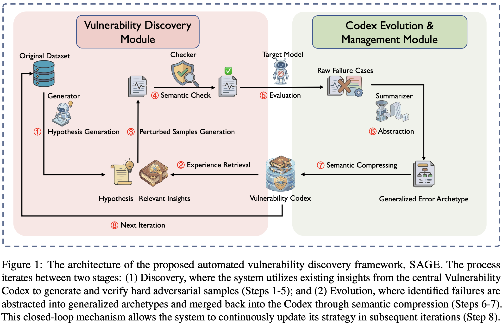
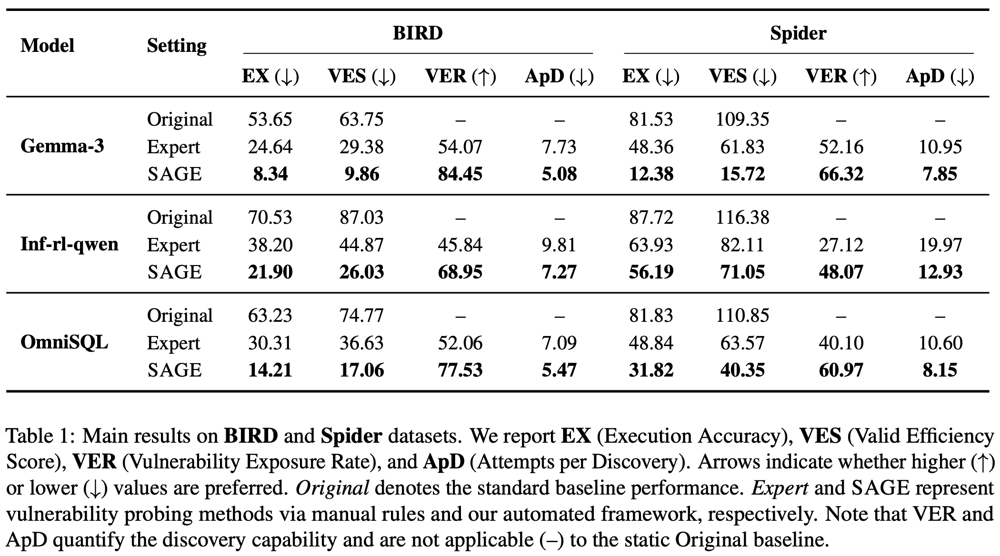

# SAGE

**Systematic Automated Guided Exploration** &mdash; autonomously discover latent vulnerabilities in LLM-based text-to-SQL generation.

Given a target text-to-SQL model and a benchmark (BIRD or Spider), SAGE iteratively finds inputs where the model fails despite being able to solve the original sample, and distills each successful attack into an evolving **Vulnerability Codex** that guides later rounds.

**On BIRD and Spider, SAGE drives target accuracy far below expert-crafted static rules** — e.g. it takes Gemma-3's BIRD execution accuracy from 53.7% (unprobed) to 8.3%, versus 24.6% for manual rules.

Companion code for *Beyond Static Rules: Automated Discovery of Latent Vulnerabilities in Text-to-SQL*.



---

## Quickstart

```bash
# 0. Environment (Python 3.10 + cu12 stack)
conda env create -f environment.yml && conda activate sage

# 1. Install the package, download data, and link your base models (one shot)
scripts/01_prepare.sh /path/to/your/model_pack      # run with -h to see options

# 2. Serve (3 vLLM endpoints: attacker / target / embedding)
scripts/02_serve.sh --target gemma-3-12b-it

# 3. Run SAGE (full BIRD dev; add --split 30 for a quick subset)
scripts/03_run_sage.sh --dataset bird_dev
```

`scripts/01_prepare.sh` prints what it is about to do and the parameters you may want to set (model pack, BIRD train split, serving GPUs). No model weights yet? Run `scripts/01_prepare.sh --download-models` to print the `huggingface-cli` commands.

## How it works

SAGE runs a closed discovery loop: a **Generator** proposes perturbations, a **Checker** validates that each preserves the gold answer, the **Target** model is probed, and a **Summarizer** abstracts every successful attack into the Vulnerability Codex that steers the next round (paper Section 3 / Algorithm 1). See [`docs/pipeline.md`](docs/pipeline.md) for the full module map.

## Results

Full results on BIRD and Spider (paper Table 1):



## Repository layout

```
SAGE/
├── src/sage/             # Python package
│   ├── config.py         #   path/config (env-var driven)
│   ├── data/             #   Spider + BIRD preprocessing (vendored spider_eval)
│   ├── prompts/          #   verbatim attack/judge/summarize templates
│   ├── server/           #   OpenAI-compatible LLM client
│   ├── agents/           #   Attacker / Target / Judger (+ Target_passK)
│   ├── strategy/         #   FAISS-backed Vulnerability Codex
│   ├── workflow/         #   end-to-end pipeline orchestration + CLI
│   ├── eval/             #   exec-match / VES / metrics / hardness
│   └── utils/            #   db/threading/log/decorator
├── configs/
│   ├── default.yaml      # global defaults (paths, sampling, workflow)
│   ├── datasets/         # spider.yaml, bird.yaml
│   └── models/           # qwen3_32b.yaml, gemma3_12b.yaml, ...
├── scripts/              # 01_prepare → 02_serve → 03_run_sage (+ check_repo)
├── tests/smoke/          # unit tests (no GPU/server needed)
├── docs/                 # per-step guides
├── pyproject.toml        # SAGE package + pinned deps
├── environment.yml       # full conda env (Python 3.10.15 + cu12 stack)
└── CITATION.cff
```

## Documentation

- [`docs/installation.md`](docs/installation.md) — environment + package install
- [`docs/data_preparation.md`](docs/data_preparation.md) — Spider + BIRD download / preprocess
- [`docs/pipeline.md`](docs/pipeline.md) — algorithm, module map, CLI flags, outputs

## Tests

```bash
pip install pytest
pytest tests/smoke/ -v        # unit tests, no GPU/server required
```

`scripts/check_repo.sh` runs the same tests plus a set of no-GPU pre-flight gates (no leaked paths, clean imports, executable scripts).

## Citation

```bibtex
@article{sage2026,
  title   = {Beyond Static Rules: Automated Discovery of Latent Vulnerabilities in Text-to-SQL},
  author  = {Hanqing Wang and Yongdong Chi and Jian Yang and Lei Yang and Jiehui Zhao and Yun Chen and Guanhua Chen},
  journal = {arXiv preprint},
  year    = {2026}
}
```

See [`CITATION.cff`](CITATION.cff) for the structured form. The arXiv link will be added here once available.

---

Licensed under the [Apache License 2.0](LICENSE); see [`NOTICE`](NOTICE) for third-party attributions.
